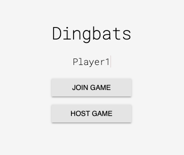

# Dingbats

Dingbats is real-time word puzzle web app to be played whilst video/phone conferencing.

## Demo

1. Select host from the main menu

    

2. Host a game by choosing a round countdown and max players

    

3. Get copy the join code for player to join the game you are hosting

    

4. Click through play to be taken to the game. Share the code with your friends via a 3rd party conferencing service to let them join the game. Game participants will not see the puzzle answer (_Parting Gift_) or the control buttons, but will have their view live updated as the game host clicks _Pass/Correct/Undo_.

    

5. Complete as many puzzles as you can before the timer runs out!

## Technical details

Dingbats uses an [Express](https://expressjs.com/) backend, and a Vanilla JavaScript frontend with styling from [Material Design Lite](https://getmdl.io/).

Real-time connectivity uses the WebSocket protocol with [ws](https://github.com/websockets/ws).

Puzzle solutions are stored in an SQLite database, which is not shared as the images used are copyrighted by [Vista Publishing Ltd](https://www.dingbats.net/).

In-game data such as the score, player IDs, WebSocket connection IDs are stored in a [Redis](https://redis.io/) in-memory database.
